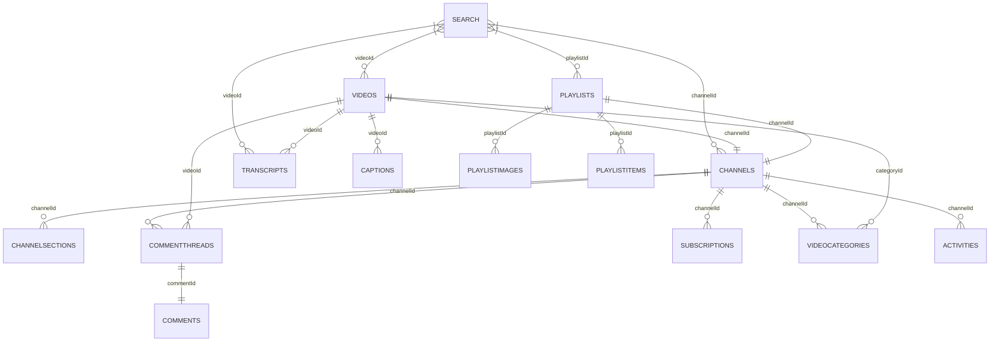

# APISM

A collection of async methods for social media APIs including:

- [X API v2](<https://developer.x.com/en/docs/x-api>)
- [YouTube Data API](<https://developers.google.com/youtube/v3>)

---

## Usage

### Installation and Usage

You can install this package directly from GitHub.

```bash
pip install git+https://github.com/isom-ds/apism.git
```

### Usage - YouTube

```python
from apism import YouTubeAPI

# Initialise the YouTube API
yt = YouTubeAPI(api_key)

# Results are stored in the object: yt.results
await yt.search('FTX')
await yt.videos()
await yt.comment_threads()
await yt.transcript()

# Save to JSON or CSV
yt.to_json()
yt.to_csv()
```


---

## Data Models

### X API v2


Endpoints not for data collection:

- `Manage Tweets`
- `Spaces`
- `Direct Messages`
- `Usage`
- `Hide Replies`
- `Blocks`
- `Mutes`

---

### YouTube Data API v3



🟩 Available
🟦 WIP
🟧 Fixing
🟥 Error
⬜ Not available

⚠️ `Transcripts` uses an undocumented part of the YouTube API.
This package wraps around the [YouTube Transcript API](<https://github.com/jdepoix/youtube-transcript-api/>).

Endpoints not for data collection:

- `Captions`
- `ChannelBanners`
- `Members`
- `MembershipsLevels`
- `Thumbnails`
- `VideoAbuseReportReasons`
- `Watermarks`
