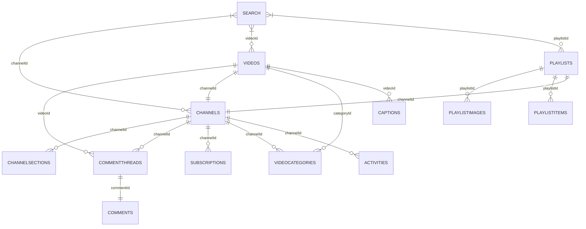

```mermaid
erDiagram
  TWEETS
  TIMELINES
  SEARCHTWEETS
  TWEETCOUNTS
  FILTEREDSTREAM
  VOLUMESTREAMS
  RETWEETS
  QUOTETWEETS
  LIKES
  BOOKMARKS
  USERSLOOKUP
  FOLLOWS
  SEARCH
  TRENDS
  LISTSLOOKUP
  LISTTWEETSLOOKUP
  LISTMEMBERS
```

# Social Media APIs

A collection of social media APIs including:

- [X API v2](<https://developer.x.com/en/docs/x-api>)
- [YouTube Data API](<https://developers.google.com/youtube/v3>)

---

## Usage

### Installation

```pip install```

### Usage

#### YouTube

```python
from youtube.search import *
from youtube.comment_threads import *

# Set query and parameters
search_params = {
    'key': key,
    'part': 'snippet',
    'type': 'video',
    'relevanceLanguage': 'en',
    'publishedAfter': '2022-12-01' + 'T00:00:00Z',
    'publishedBefore': '2022-12-01' + 'T23:59:59Z',
    'order': 'viewCount'
    }
video_params = {
    'key': key,
    'part': 'id,replies,snippet',
    'order': 'time'
    }

# Search API
search_results = await fetch_search_results('FTX', search_params)

# CommentThreads API
l_video_ids = list(set([i['id']['videoId'] for i in search_results]))
comments_concurrent_results = await fetch_comment_threads(l_video_ids, video_params)
```


---

## Data Models

### X API v2



Endpoints not for data collection:

- `Manage Tweets`
- `Spaces`
- `Direct Messages`
- `Usage`
- `Hide Replies`
- `Blocks`
- `Mutes`

---

### YouTube Data API v3



🟩 Available
🟦 WIP
🟧 Fixing
🟥 Error
⬜ Not available

Endpoints not for data collection:

- `Captions`
- `ChannelBanners`
- `Members`
- `MembershipsLevels`
- `Thumbnails`
- `VideoAbuseReportReasons`
- `Watermarks`
