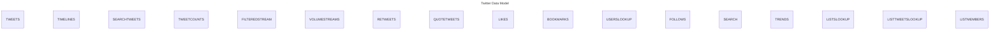

# Social Media APIs

A collection of social media APIs including:

- [X API v2](<https://developer.x.com/en/docs/x-api>)
- [YouTube Data API](<https://developers.google.com/youtube/v3>)

---
## X API v2



### Endpoints not for data collection 
- `Manage Tweets`
- `Spaces`
- `Direct Messages`
- `Usage`
- `Hide Replies`
- `Blocks`
- `Mutes`

---

## YouTube Data API

### Requirements
`aiogoogle`
`googleapiclient`

```mermaid
%%{init: {
  "themeCSS": [
    "[id^=entity-SEARCH] .er.entityBox { fill: green;} ",
    "[id^=entity-VIDEOS] .er.entityBox { fill: green;} ",
    "[id^=entity-COMMENTTHREADS] .er.entityBox { fill: green;} ",
    "[id^=entity-mytable] .er.entityBox { fill: powderblue;} ",
    "[id^=entity-anothertable] .er.entityBox { fill: pink;} "
    ]
}}%%
---
title: YouTube Data Model
---
erDiagram
    SEARCH }|--o{ CHANNELS : channelId
    SEARCH }|--o{ VIDEOS : videoId
    SEARCH }|--o{ PLAYLISTS : playlistId
    CHANNELS ||--o{ CHANNELSECTIONS : channelId
    CHANNELS ||--o{ COMMENTTHREADS : channelId
    CHANNELS ||--o{ SUBSCRIPTIONS : channelId
    CHANNELS ||--o{ VIDEOCATEGORIES : channelId
    CHANNELS ||--o{ ACTIVITIES : channelId
    VIDEOS ||--o{ COMMENTTHREADS : videoId
    VIDEOS ||--|| CHANNELS : channelId
    VIDEOS ||--o{ VIDEOCATEGORIES : categoryId
    VIDEOS ||--o{ CAPTIONS : videoId
    PLAYLISTS ||--o{ PLAYLISTIMAGES : playlistId
    PLAYLISTS ||--o{ PLAYLISTITEMS : playlistId
    PLAYLISTS ||--|| CHANNELS : channelId
    COMMENTTHREADS ||--|| COMMENTS : commentId
```
### Endpoints not for data collection 
- `ChannelBanners`
- `Members`
- `MembershipsLevels`
- `Thumbnails`
- `VideoAbuseReportReasons`
- `Watermarks`
