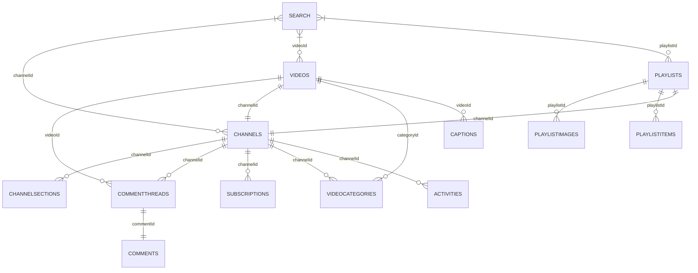

```mermaid
erDiagram
  TWEETS
  TIMELINES
  SEARCHTWEETS
  TWEETCOUNTS
  FILTEREDSTREAM
  VOLUMESTREAMS
  RETWEETS
  QUOTETWEETS
  LIKES
  BOOKMARKS
  USERSLOOKUP
  FOLLOWS
  SEARCH
  TRENDS
  LISTSLOOKUP
  LISTTWEETSLOOKUP
  LISTMEMBERS
```

# Social Media APIs

A collection of social media APIs including:

- [X API v2](<https://developer.x.com/en/docs/x-api>)
- [YouTube Data API](<https://developers.google.com/youtube/v3>)

---
## X API v2

### Data Model

### Endpoints not for data collection 
- `Manage Tweets`
- `Spaces`
- `Direct Messages`
- `Usage`
- `Hide Replies`
- `Blocks`
- `Mutes`

### Requirements

---

## YouTube Data API

### Data Model

🟩 Available
🟦 WIP
🟧 Fixing
🟥 Error
⬜ Not available

### Endpoints not for data collection 
- `ChannelBanners`
- `Members`
- `MembershipsLevels`
- `Thumbnails`
- `VideoAbuseReportReasons`
- `Watermarks`

### Requirements
`aiogoogle`
`googleapiclient`
