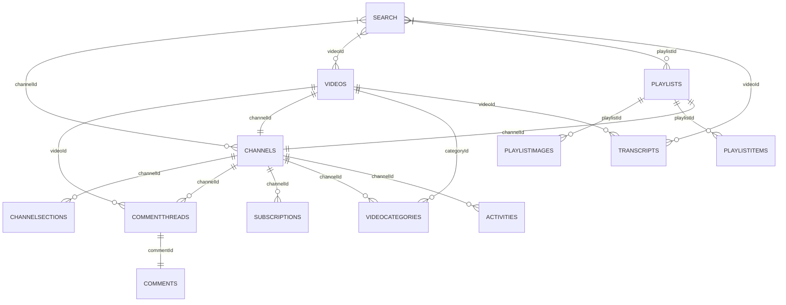
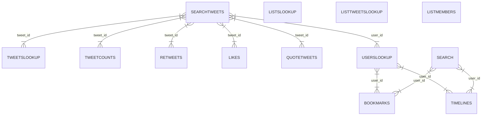

# APISM

## Abstract
Social media research at scale requires programmatic access to platform APIs, yet the heterogeneity of API interfaces and authentication schemes introduces significant friction. This package provides a unified, asynchronous Python interface for the YouTube Data API v3 and X API v2, abstracting endpoint complexity into simple method calls and handling data serialisation to JSON and CSV. It was developed as foundational data collection infrastructure for the *Epidemiology of Online Emotions* PhD research programme.

## Research Context
- **Thesis:** *Epidemiology of Online Emotions* (Kok-Shun, 2026)
- **Chapter:** Research infrastructure (used across Chapters 4–7)
- **Contribution type:** Artefact (open-source social media data collection library)
- **Associated papers:** "Leveraging ChatGPT for Sponsored Ad Detection and Keyword Extraction in Youtube Videos," IEEE i-COSTE 2024; "An AI-powered solution for detecting and categorising sponsored ad segments in YouTube videos," *Software Impacts* 2025

A collection of async methods for social media APIs including:

- [YouTube Data API](<https://developers.google.com/youtube/v3>)
- [X API v2](<https://developer.x.com/en/docs/x-api>)

---

## Usage

### Installation and Usage

You can install this package directly from GitHub.

```bash
pip install git+https://github.com/isom-ds/apism.git
```

### YouTube

```python
from apism import YouTubeAPI

# Initialise the YouTube API
yt = YouTubeAPI(key)

# Results are stored in the object: yt.results
await yt.search('FTX')
await yt.videos()
await yt.comment_threads()
await yt.transcript()

# Save to JSON or CSV
yt.to_json()
yt.to_csv()
```

### X

```python
from apism import xAPI

# Initialise the X API
params = {
    'search_tweets': {
        "query": "OpenAI",
        "max_results": 10
    }
}
x = xAPI(token, params)

# Results are stored in the object: x.results
await x.search_tweets(type='recent')
```

---

## Data Models


### YouTube Data API v3


```mermaid
%%{init: {
  "themeCSS": [
    "[id^=entity-SEARCH] .er.entityBox { fill: green;} ",
    "[id^=entity-VIDEOS] .er.entityBox { fill: green;} ",
    "[id^=entity-COMMENTTHREADS] .er.entityBox { fill: green;} ",
    "[id^=entity-TRANSCRIPTS] .er.entityBox { fill: green;} ",
    "[id^=entity-API] .er.entityBox { fill: blue;} ",
    "[id^=entity-API] .er.entityBox { fill: orange;} ",
    "[id^=entity-API] .er.entityBox { fill: red;} "
    ]
}}%%
erDiagram
    SEARCH }|--o{ CHANNELS : channelId
    SEARCH }|--o{ VIDEOS : videoId
    SEARCH }|--o{ PLAYLISTS : playlistId
    SEARCH }|--o{ TRANSCRIPTS : videoId
    CHANNELS ||--o{ CHANNELSECTIONS : channelId
    CHANNELS ||--o{ COMMENTTHREADS : channelId
    CHANNELS ||--o{ SUBSCRIPTIONS : channelId
    CHANNELS ||--o{ VIDEOCATEGORIES : channelId
    CHANNELS ||--o{ ACTIVITIES : channelId
    VIDEOS ||--o{ COMMENTTHREADS : videoId
    VIDEOS ||--|| CHANNELS : channelId
    VIDEOS ||--o{ VIDEOCATEGORIES : categoryId
    VIDEOS ||--o{ TRANSCRIPTS : videoId
    PLAYLISTS ||--o{ PLAYLISTIMAGES : playlistId
    PLAYLISTS ||--o{ PLAYLISTITEMS : playlistId
    PLAYLISTS ||--|| CHANNELS : channelId
    COMMENTTHREADS ||--|| COMMENTS : commentId
```

🟩 Available
🟦 WIP
🟧 Fixing
🟥 Error
⬜ Not available

⚠️ `Transcripts` uses an undocumented part of the YouTube API.
This package wraps around the [YouTube Transcript API](<https://github.com/jdepoix/youtube-transcript-api/>).

Endpoints not for data collection:

- `Captions`
- `ChannelBanners`
- `Members`
- `MembershipsLevels`
- `Thumbnails`
- `VideoAbuseReportReasons`
- `Watermarks`

### X API v2


```mermaid
%%{init: {
  "themeCSS": [
    "[id^=entity-SEARCHTWEETS] .er.entityBox { fill: green;} ",
    "[id^=entity-API] .er.entityBox { fill: blue;} ",
    "[id^=entity-API] .er.entityBox { fill: orange;} ",
    "[id^=entity-API] .er.entityBox { fill: red;} "
    ]
}}%%
erDiagram
  SEARCHTWEETS }|--|{ TWEETSLOOKUP : tweet_id
  SEARCHTWEETS }|--|{ TWEETCOUNTS : tweet_id
  SEARCHTWEETS }|--|{ RETWEETS : tweet_id
  SEARCHTWEETS }|--|{ LIKES : tweet_id
  SEARCHTWEETS }|--|{ QUOTETWEETS : tweet_id
  SEARCHTWEETS }|--|{ USERSLOOKUP : user_id
  USERSLOOKUP }|--|{ BOOKMARKS: user_id
  USERSLOOKUP }|--|{ TIMELINES: user_id
  SEARCH }|--|{ BOOKMARKS: user_id
  SEARCH }|--|{ TIMELINES: user_id
  LISTSLOOKUP
  LISTTWEETSLOOKUP
  LISTMEMBERS
```

🟩 Available
🟦 WIP
🟧 Fixing
🟥 Error
⬜ Not available

Endpoints to define rules for stream data collection
- `Filtered Stream`
- `Volume Stream`

Endpoints not for data collection:

- `Manage Tweets`
- `Spaces`
- `Direct Messages`
- `Usage`
- `Hide Replies`
- `Follows`
- `Blocks`
- `Mutes`

---

## References

[1] B. V. Kok-Shun and J. Chan, "Leveraging ChatGPT for Sponsored Ad Detection and Keyword Extraction in Youtube Videos," in *2024 International Conference on Sustainable Technology and Engineering (i-COSTE)*, Perth, Australia: IEEE, 2024, pp. 1–6.

[2] J. Chan and B. V. Kok-Shun, "An AI-powered solution for detecting and categorising sponsored ad segments in YouTube videos," *Software Impacts*, vol. 24, p. 100759, 2025.

<details>
<summary>BibTeX</summary>

```bibtex
@inproceedings{P12_kok-shun_leveraging_2024,
  address   = {Perth, Australia},
  title     = {Leveraging {ChatGPT} for {Sponsored} {Ad} {Detection} and {Keyword} {Extraction} in {Youtube} {Videos}},
  booktitle = {2024 {International} {Conference} on {Sustainable} {Technology} and {Engineering} (i-{COSTE})},
  publisher = {IEEE},
  author    = {Kok-Shun, Brice Valentin and Chan, Johnny},
  year      = {2024},
  pages     = {1--6},
}

@article{P12_chan_ai-powered_2025,
  title   = {An {AI}-powered solution for detecting and categorising sponsored ad segments in {YouTube} videos},
  volume  = {24},
  journal = {Software Impacts},
  author  = {Chan, Johnny and Kok-Shun, Brice Valentin},
  year    = {2025},
  pages   = {100759},
}
```

</details>
